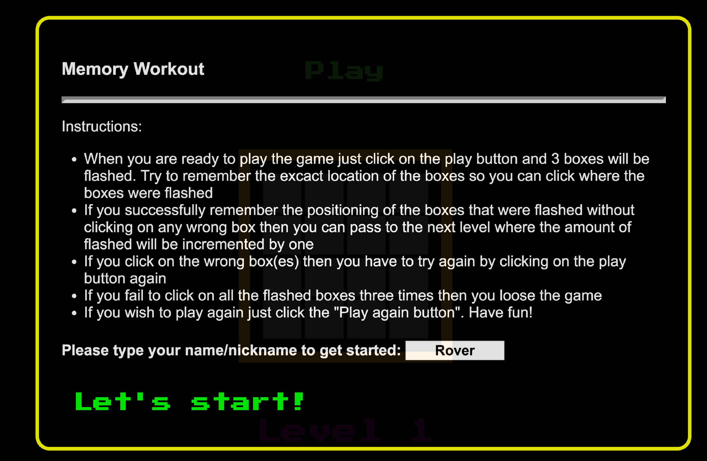
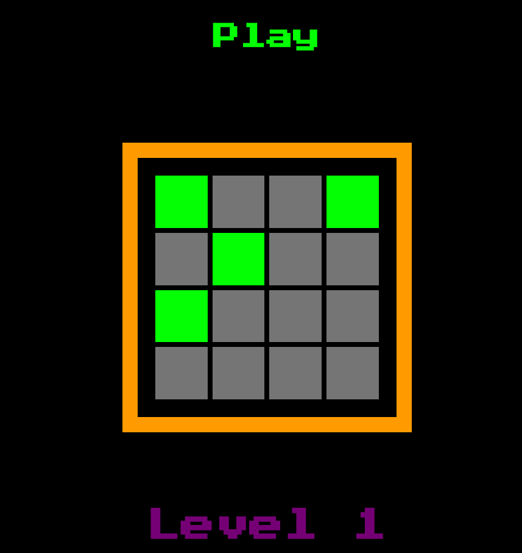

# Change-Calculator
This app could be used in a cash register. When the item price is inputted, along with the bill used to pay, this calculator outputs the exact amount of bills and coins needed to make change.

## Landing page

## Sample

